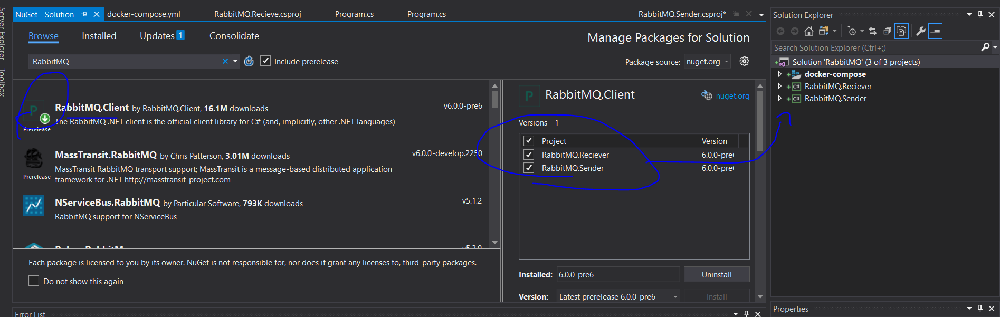

# In the Name of ALLAH 
## RabbitMQ.DotnetCore

> RabbitMQ is the most widely deployed open source message broker.
## RabbitMQ supports several messaging protocols, directly and through the use of plugins. This page describes the supported protocols and helps differentiate between them.

- __AMQP 0-9-1__ and extensions
RabbitMQ was originally developed to support AMQP 0-9-1.
  - As such this protocol is the "core" protocol supported by the broker. All of these variants are fairly similar to each other, with later versions tidying up unclear or unhelpful parts of earlier versions. We have extended AMQP 0-9-1 in various ways.

  - AMQP 0-9-1 is a binary protocol, and defines quite strong messaging semantics. For clients it's a reasonably easy protocol to implement, and as such there are a large number of client libraries available for many different programming languages and environments.

## Console Solution for simulation
 - contains 2 Projects a simpler sender and a reciever.
 - let's configure them to use rabbitMQ transmission AMQP using nuget package manager
 .
 - Initializing the docker rabbitmq container
 ``` 
  docker run -p 5672:5672 -p 15672:15672 rabbitmq:management
  ```
  
  

 - then write the code of publish and subscribe application for events
 - the Results of the app :
   
   
